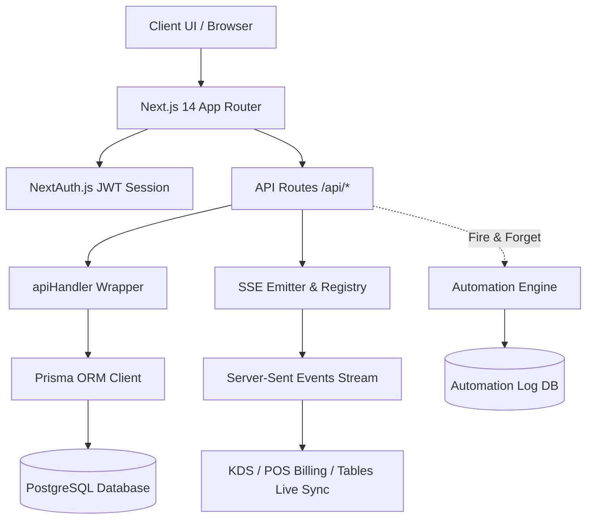
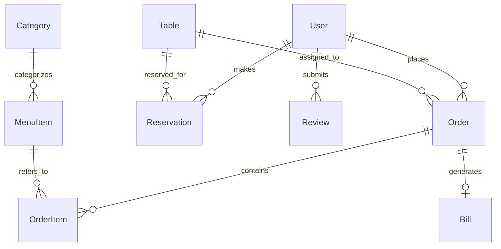
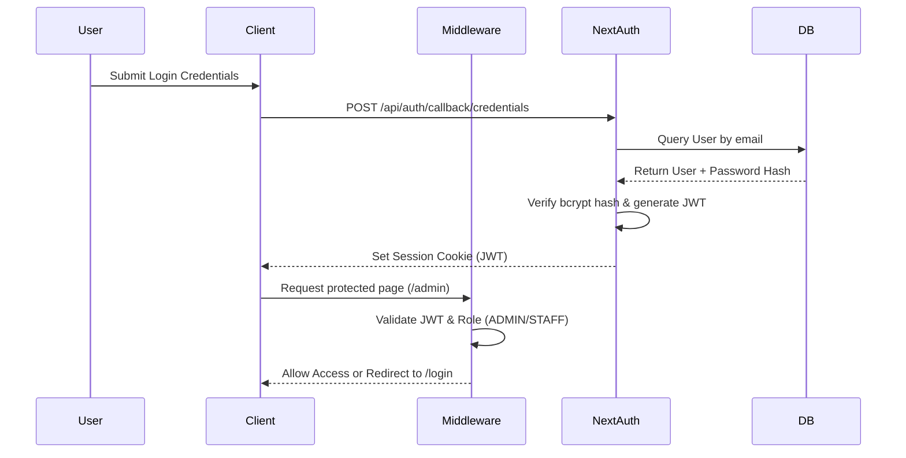
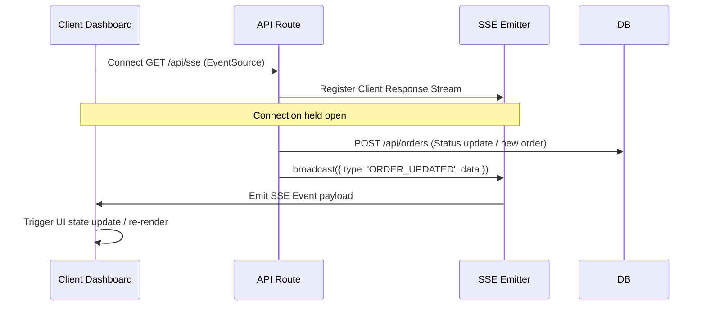
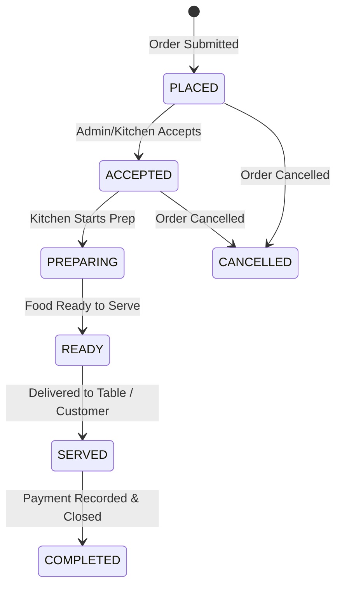
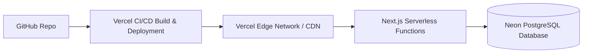

# Architecture.md — AddaDotCom System Architecture

## System Architecture Overview



---

## Tech Stack Table

| Layer | Technology | Version | Purpose |
|-------|-----------|---------|---------|
| Framework | Next.js | 14.2.29 | App Router, SSR, API Routes |
| Language | TypeScript | 5.x | End-to-end type safety |
| Database | PostgreSQL | Latest | Relational data store (Neon / Supabase) |
| ORM | Prisma | 6.9.0 | Type-safe DB client |
| Auth | NextAuth.js | 4.24.11 | JWT + Google OAuth |
| State | Zustand | 5.0.5 | Cart + UI state |
| Animation | Framer Motion | 12.12.0 | UI transitions & gestures |
| Animation | GSAP | 3.15.0 | Scroll & entrance animations |
| Scroll | Lenis | 1.3.25 | Smooth scroll engine |
| Charts | Recharts | 2.15.3 | Analytics dashboards |
| PDF | @react-pdf/renderer | 4.3.0 | GST Invoice PDF rendering |
| QR Code | qrcode.react | 4.2.0 | Table & Invoice QR codes |
| Validation | Zod | 4.4.3 | Schema validation |
| Logging | Winston | 3.17.0 | Server logs |
| Testing | Puppeteer | 25.3.0 | E2E testing |

---

## Folder Structure

```
addadotcom/
├── docs/                 # Authoritative project documentation system
├── prisma/
│   ├── schema.prisma     # 17 Prisma models & 6 enums
│   └── seed.ts           # Database seeder script
├── public/               # Static assets & images
└── src/
    ├── app/
    │   ├── (public)      # Homepage, menu, order, track, reserve, account, invoice
    │   ├── admin/        # Billing, kitchen, tables, history, analytics, automation
    │   └── api/          # 25+ REST API route endpoints
    ├── components/
    │   ├── animations/   # GSAP & Framer Motion wrappers
    │   ├── cart/         # Cart Drawer & item controls
    │   ├── invoice/      # 8 GST Invoice rendering sub-components
    │   ├── layout/       # Navbar, Footer, AdminSidebar, AdminNotifier
    │   └── shared/       # Status badges, buttons, modals
    ├── lib/
    │   ├── automation/   # Automation Engine, conditions, actions, queue
    │   ├── api-helpers.ts# Standard API wrapper & error handlers
    │   ├── sse-emitter.ts# Server-Sent Events broadcast hub
    │   ├── auth.ts       # NextAuth JWT & authorization config
    │   ├── prisma.ts     # Singleton Prisma client instance
    │   └── validations.ts# Zod schemas for all forms & payloads
    └── store/
        └── index.ts      # Zustand cart & UI persistent state
```

---

## Database Relationships



---

## Authentication Flow



---

## Real-Time SSE Architecture



---

## Order Status State Machine



---

## Automation Engine Architecture

```mermaid
flowchart TD
    Event[API Trigger Event] --> Engine[AutomationEngine.fire()]
    Engine --> QueryWorkflows[Fetch Active Workflows from DB]
    QueryWorkflows --> CondCheck{Evaluate Trigger & Conditions}
    CondCheck -- True --> ExecAction[Execute Workflow Actions]
    CondCheck -- False --> Skip[Skip Execution]
    ExecAction --> Log[Write to AutomationLog DB]
```

---

## Deployment Architecture


